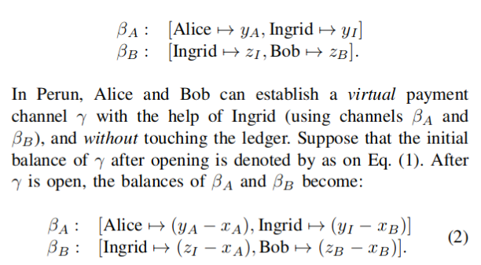
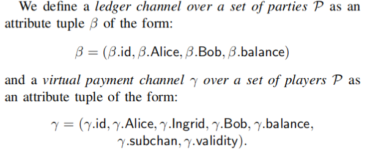
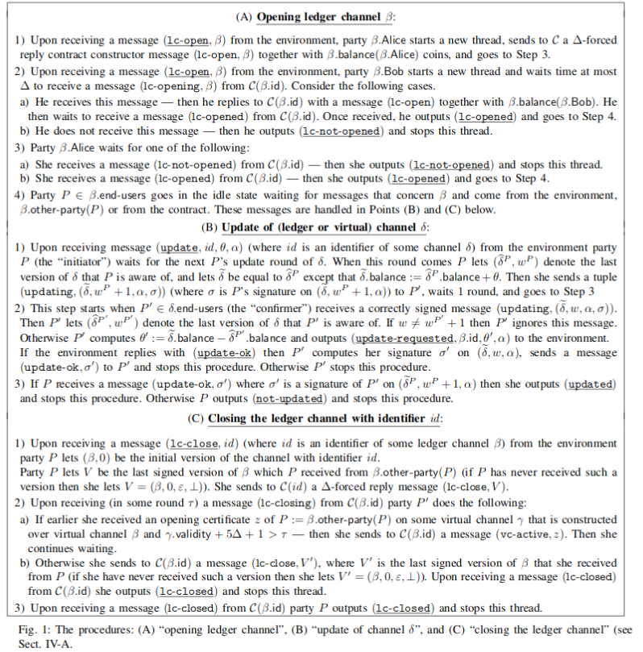
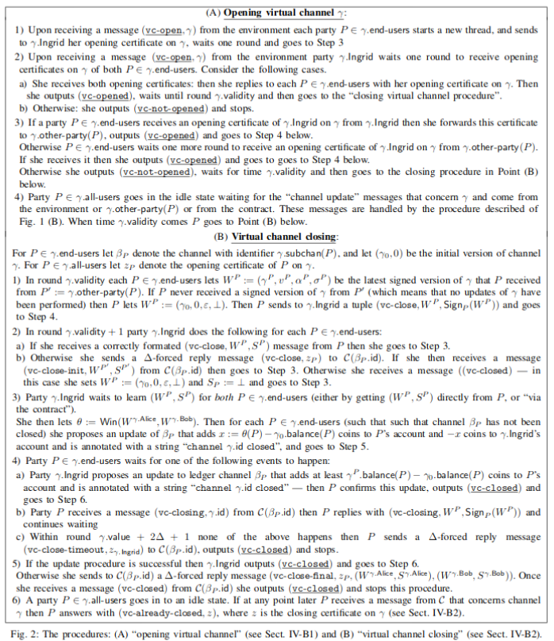
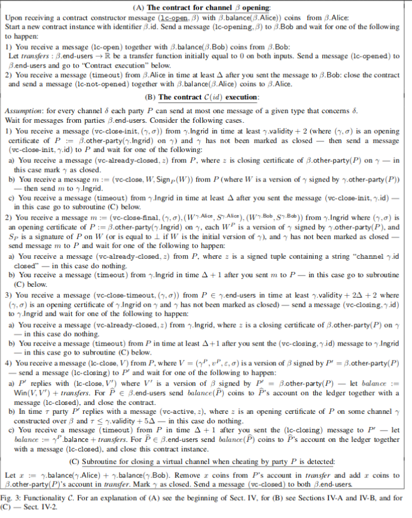

# Perun: virtual payment and state channel networks

Virtual payment hubs - multihop - used by SpankChain & Connext (connext was going to use HTLCs but opted for Perun's construction).

> Hashlocks are a pay-per-message pricing model. Every message needs to be routed through the network, and each node it passes through will require a fee for that. In a telecoms analogy, hashlocks are like text messages, where you pay per text.

> Virtual channels are a line-rental pricing model. You set up a connection to your counterparty and pay the intermediaries for the time they keep that connection open. While you have the connection open you can send as many messages down it as you want. In the telecoms analogy, virtual channels are like phone calls, where you pay per minute.

> Virtual channels are exciting because they enable a different pricing model - one that will be more suited to some applications. They’re also exciting because they allow more general applications; to extend the analogy: if you have a modem, you can stream video over your phone call, but you’d have a tough time doing that by transmitting the data via text.

## Links

[Perun: Virtual Payment Hubs over Cryptographic Currencies](http://eprint.iacr.org/2017/635)

[Foundations of state channel networks](https://eprint.iacr.org/2018/320)

[ethresearch](https://ethresear.ch/t/perun-virtual-payment-and-state-channel-networks/1685)

[Connext Docs](http://docs.connext.network/api.html)

[Connext Github](https://github.com/ConnextProject)

## Paper

- Ledger Channel: Payment channel between 2 parties. - classic payment channel.
- Virtual Channel: Connects Ledger Channels. Applies the channel technique recursively, i.e. Alice and Bob may not have a direct connection with each other, but if Alice has a channel with Ingrid, and Ingrid has a channel with Bob, they can exchange funds. This is a hub based model!

Σ = channel space, ledger + virtual channels

For every virtual channel γ in Σ there need be 2 ledger channels α,β in Σ that are connected to the virtual channel, i.e. γ.subchan(γ.Alice) = α.id && γ.subchan(γ.Bob) = β.id

γ^ = current state of the channel. δ can either be a ledger or a virtual channel. θ = transfer function. 

update(id, θ, α) = update channel with transfer function and annotation

Since contracts do not act on themselves, P sends to C(id) a Δ-forced-reply message which calls a timeout functionality on a contract after Δ has passed.

### Opening - Updating - Closing a Ledger channel

### Opening - Closing a Virtual channel (Updating as before)

### Contract Func

