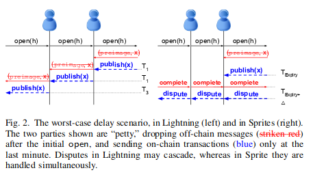
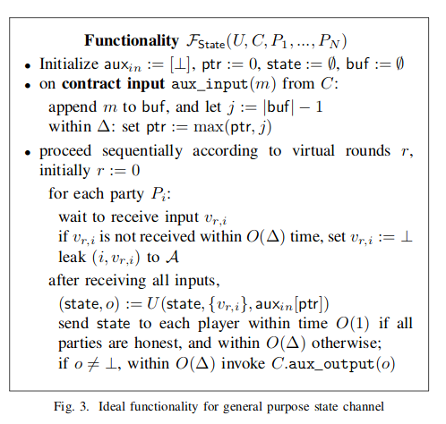
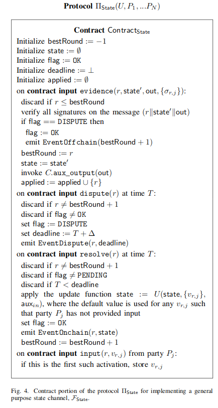
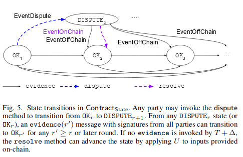
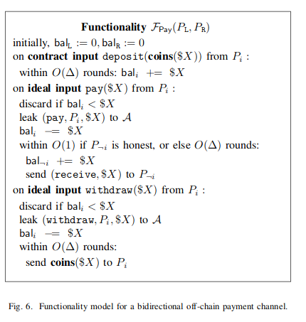
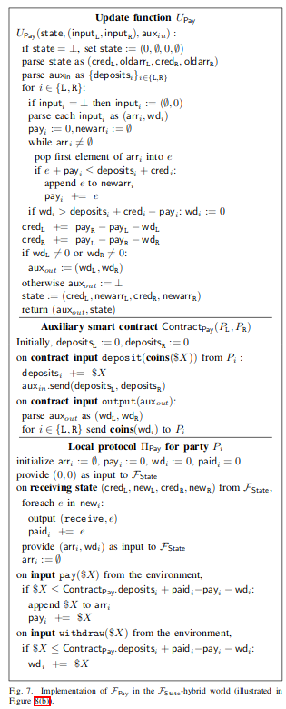

# Sprites and State Channels: Payment Networks that Go Faster than Lightning

## Links
[Blog Summary](https://blog.enuma.io/update/2018/05/24/sprites-state-channels.html)

[Paper](https://arxiv.org/pdf/1702.05812.pdf)

## TL;DR
Fast settlement in O(l+Δ) instead of LN settlement which requires O(lΔ) in the worst case where there is a dispute in all hops. $l$ is the amount of hops, $Δ$ is the time needed to settle a tx on chain. In Sprites all disputes are handled simultaneously.

No privacy guarantees? 

## General Purpose State Channel Ideal Functionality

Happy case: O(1) settlement (as usual). In each round apply state transition U (can be changed depending on state-channel usecase).  Communicate with smart contract `C` through `aux_input` & `aux_output`. Broadcast state to players within Θ(Δ). 

Liveness & Safety, OK.

## General Purpose State Channel Protocol

Advance state off-chain: Signed message exchange of \sigma_{r,i} = (r || state at r || output state), i = signer.

## Bidirectional off-chain payment channel functionality
Channel established by an initial deposit. P_L, P_R two parties. Reduce sender's balance in O(1), increase receiver's balance in O(1) happy-case, or O(Δ) if there is an on-chain dispute settlement. 

## Bidirectional channel in the general state world

## Chained-Payment Functionality
